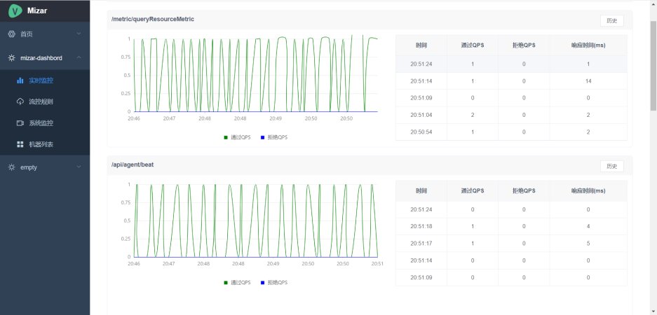
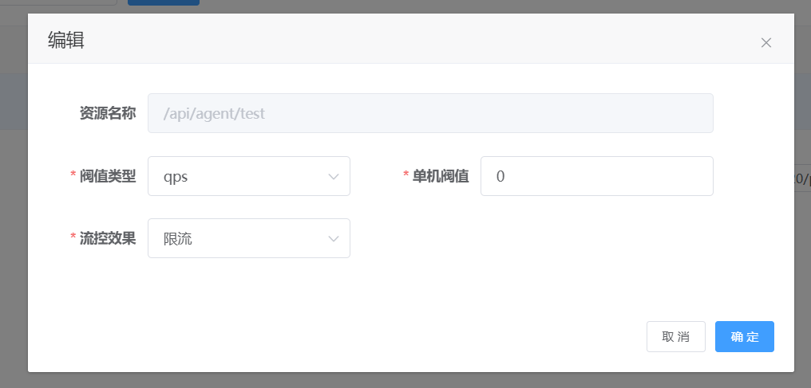
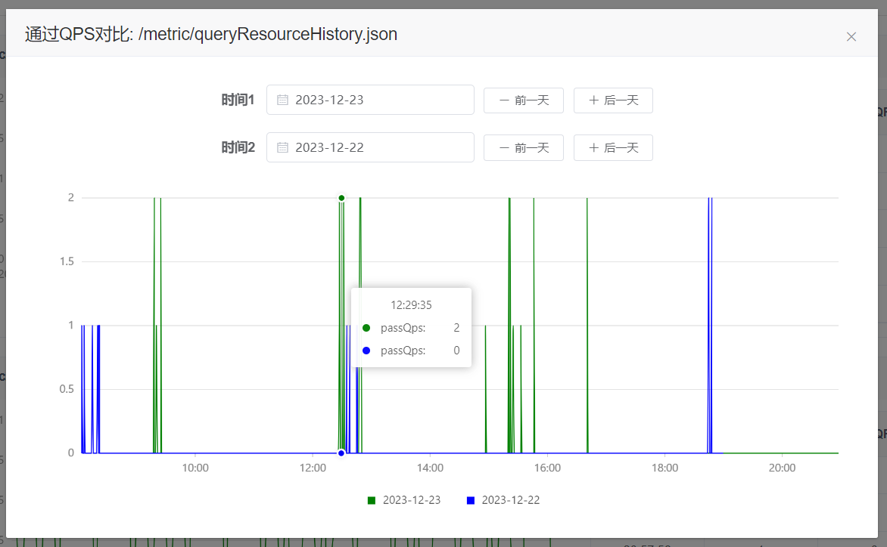
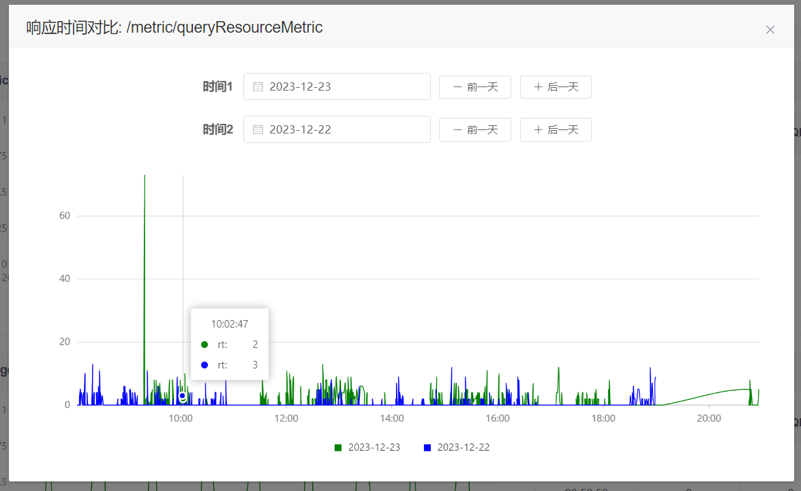
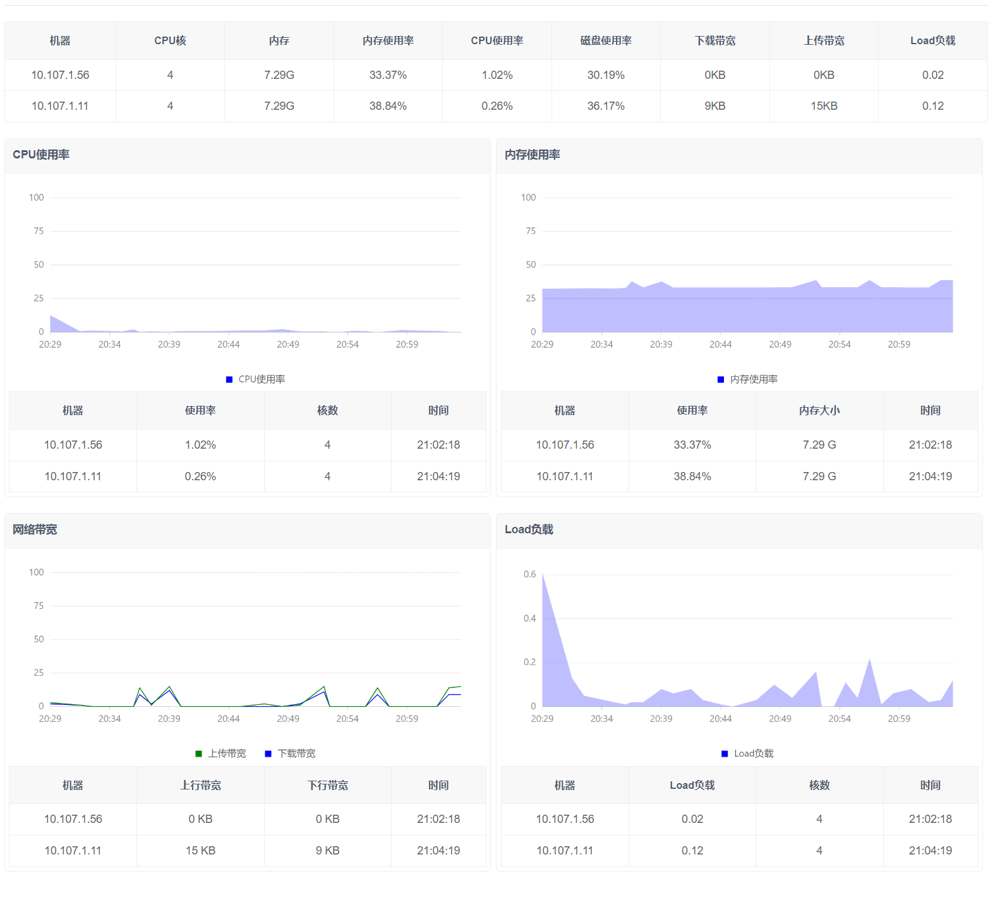
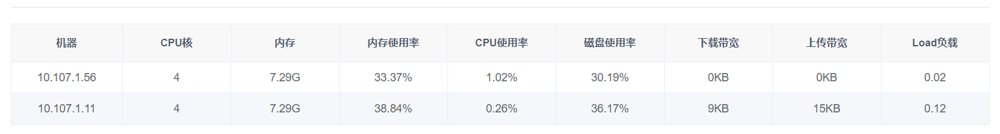
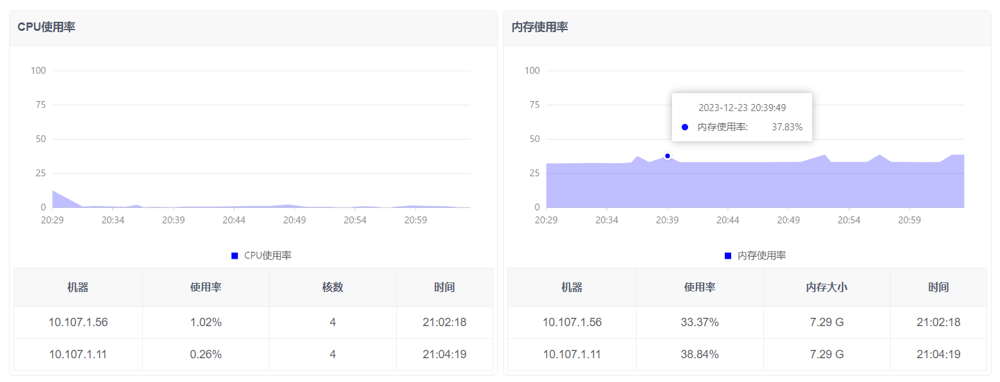
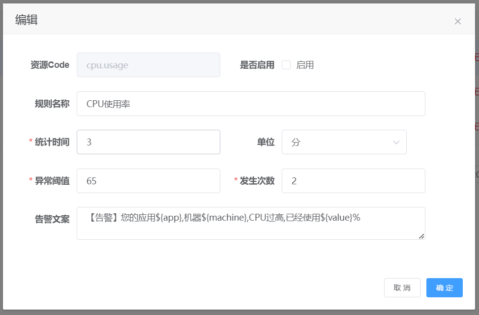

# mizar-pro

#### 介绍

接口流量监控，接口限流，系统监控工具，内存，cpu，网络带宽，磁盘空间及IO，硬盘smart，系统负载，网络流量等监控，告警
企业级系统监控 流量监控

Sentinel是一套优秀的的面向分布式服务架构的高可用流量防护组件,
Mizar是参考sentinel优化改造后的一套企业级的系统监控平台。

#### 软件架构
在线文档地址
https://www.yuque.com/alixiaxia/de1egc
在线试用地址

http://39.101.169.205:8087/index
用户名: admin 123456 (请不要修改密码)

**Mizar产品特性**

1. 轻量级。Agent只引入了netty通信组件，没有其他多余依赖；dashboard只依赖mysql数据库，不依赖nacos，Zookeeper，redis等其他中间件。
2. 功能丰富。支持异常限流告警，支持限流规则，流量的持久化，流量的历史对比；支持系统的CPU，load，内存，JVM监控。
3. 高性能。大量参考sentinel代码设计理念，采用sentinel的滑动窗口进行统计QPS，使用服务端pull拉取数据，减少业务系统的消耗。
4. 高可用。供了分布式的高可用解决方案，支持dashboard分片式集群。
5. 易维护扩展。代码精简易读，易上手。QPS的核心监控就3个Class，每个class类不足50行。（不知道有没有一套代码复杂度的评判工具）

#### 安装教程

1. 初始化数据库。文件在doc目录中。
2. 修改yml文件。只需要更改数据库配置即可。
3. 本地启动。idea指定spring active profile = local 。
4. 浏览器打开。默认端口8083, http://127.0.0.1:8083/index   默认admin 123456

   大概等30秒即可看到监控列表有数据上来。

#### 产品功能截图

1. 流量监控
   
2. 接口限流
   
3. 历史记录对比
   
   
4. 系统监控
   
   
   
5. 告警规则
   
#### 参与贡献

1. Fork 本仓库
2. 新建 Feat_xxx 分支
3. 提交代码
4. 新建 Pull Request

#### 欢迎联系
1.功能还在持续研发中，一个人实在是太难了，欢迎联系交流或合作。

2.联系方式：QQ690343902  email：tcxhb123@163.com
